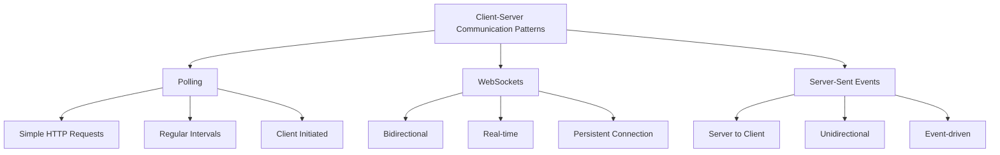
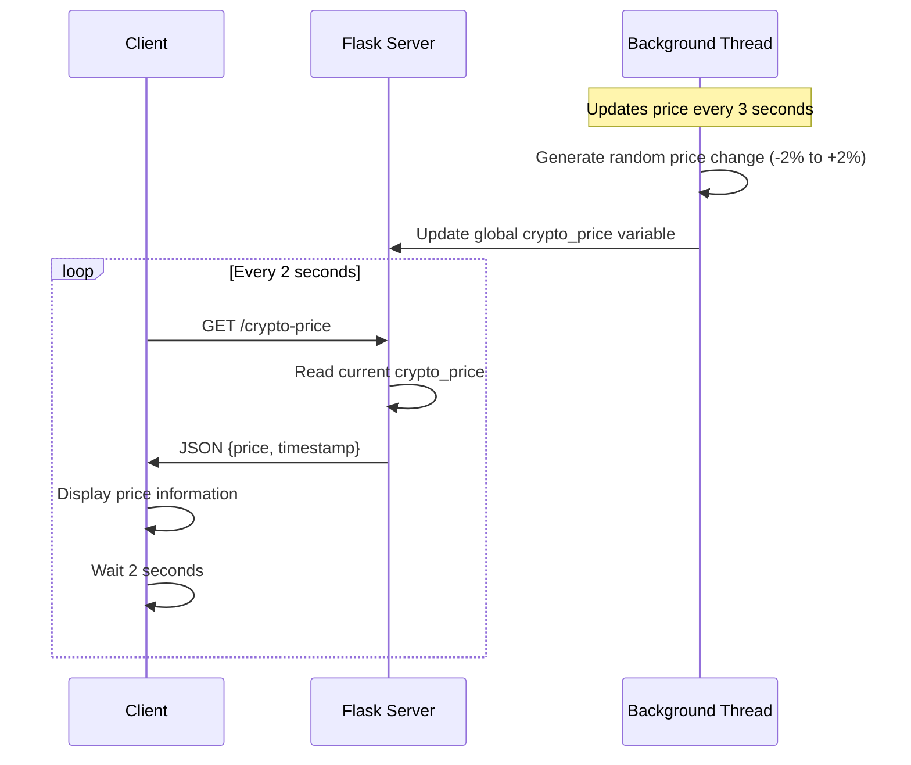
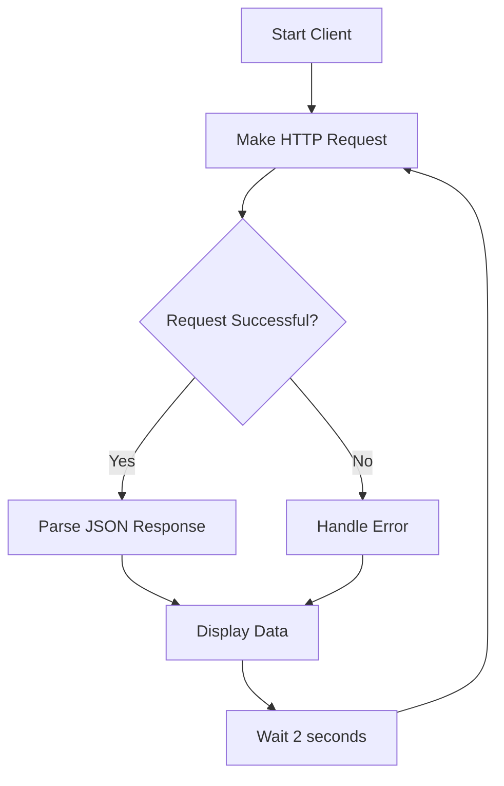

# 🚀 CryptoFluctuationProject

A Python Flask-based learning project demonstrating **API Polling** concepts through real-time cryptocurrency price simulation.


## 📖 Table of Contents

- [Overview](#overview)
- [What is API Polling?](#what-is-api-polling)
- [Project Architecture](#project-architecture)
- [Features](#features)
- [Installation & Setup](#installation--setup)
- [Usage](#usage)
- [API Endpoints](#api-endpoints)
- [Code Analysis](#code-analysis)
- [Docker Support](#docker-support)
- [CI/CD Pipeline](#cicd-pipeline)
- [Learning Outcomes](#learning-outcomes)

## 🎯 Overview

This project simulates a cryptocurrency trading platform where prices fluctuate in real-time. It demonstrates the **API Polling** pattern where a client continuously requests data from a server at regular intervals to stay updated with the latest information.

## 🔄 What is API Polling?

**API Polling** is a communication pattern where a client repeatedly makes requests to a server at regular intervals to check for new data or updates. It's one of the most common methods for achieving near real-time data synchronization.

### Polling vs Other Patterns



### Advantages of Polling
- ✅ Simple to implement
- ✅ Works with standard HTTP
- ✅ No persistent connections required
- ✅ Easy to debug and monitor

### Disadvantages of Polling
- ❌ Higher network overhead
- ❌ Increased server load
- ❌ Potential for outdated data
- ❌ Battery drain on mobile devices

## 🏗️ Project Architecture

```mermaid
graph LR
    subgraph "Server Side (Flask)"
        A[Flask App] --> B[Background Thread]
        B --> C[Price Update Logic]
        C --> D[Global Price Variable]
        A --> E[/crypto-price Endpoint]
    end
    
    subgraph "Client Side"
        F[Python Client] --> G[HTTP Request Loop]
        G --> H[Parse JSON Response]
        H --> I[Display Price]
        I --> J[Wait 2 seconds]
        J --> G
    end
    
    E -->|JSON Response| H
    G -->|GET Request| E
```

### System Flow Diagram



## ✨ Features

- 🔄 **Real-time Price Simulation**: Prices update every 3 seconds with realistic fluctuations
- 📊 **RESTful API**: Clean `/crypto-price` endpoint returning JSON data
- 🔁 **Automatic Polling**: Client polls server every 2 seconds
- 🧵 **Multi-threading**: Background thread handles price updates independently
- 📦 **Docker Ready**: Containerized application for easy deployment
- 🚀 **CI/CD Pipeline**: GitHub Actions workflow for testing and deployment
- 📈 **Realistic Fluctuations**: Price changes between -2% to +2% mimicking real markets

## 🛠️ Installation & Setup

### Prerequisites
- Python 3.9+
- pip package manager
- (Optional) Docker for containerization

### Local Development Setup

1. **Clone the repository**
   ```bash
   git clone <your-repo-url>
   cd CryptoFluctuationProject
   ```

2. **Create virtual environment**
   ```bash
   python -m venv envCryptoAPIPool
   source envCryptoAPIPool/bin/activate  # On Windows: envCryptoAPIPool\Scripts\activate
   ```

3. **Install dependencies**
   ```bash
   pip install -r requirements.txt
   ```

4. **Run the Flask server**
   ```bash
   python app.py
   ```

5. **Run the client (in a separate terminal)**
   ```bash
   python client.py
   ```

## 🎮 Usage

### Starting the Server
```bash
$ python app.py
 * Running on http://127.0.0.1:5000
Price updated: $101.23
Price updated: $99.87
Price updated: $100.45
...
```

### Running the Client
```bash
$ python client.py
Starting cryptocurrency price API polling...
Price: $101.23 | Time: 1692789123.45
Price: $99.87 | Time: 1692789125.67
Price: $100.45 | Time: 1692789127.89
...
```

## 🌐 API Endpoints

### GET `/crypto-price`

Returns the current cryptocurrency price with timestamp.

**Response Format:**
```json
{
  "price": 101.23,
  "timestamp": 1692789123.456
}
```

**Response Fields:**
- `price` (float): Current cryptocurrency price rounded to 2 decimal places
- `timestamp` (float): Unix timestamp when the response was generated

**Example cURL Request:**
```bash
curl http://localhost:5000/crypto-price
```

## 🔍 Code Analysis

### Server Side Analysis (`app.py`)

```python
# Key Components:

1. **Global State Management**
   crypto_price = 100.00  # Shared state between threads

2. **Background Price Updates**
   def update_price():
       # Updates every 3 seconds with ±2% fluctuation
       change = random.uniform(-0.02, 0.02)
       crypto_price *= (1 + change)

3. **Threading Implementation**
   threading.Thread(target=update_price, daemon=True).start()
   # Daemon thread ensures clean shutdown

4. **REST API Endpoint**
   @app.route('/crypto-price')
   def get_crypto_price():
       return jsonify({
           'price': round(crypto_price, 2),
           'timestamp': time.time()
       })
```

**Strengths:**
- ✅ Clean separation of concerns
- ✅ Thread-safe global variable access
- ✅ Proper JSON response formatting
- ✅ Daemon thread for clean shutdown

**Areas for Improvement:**
- 🔄 Could add thread locks for absolute safety
- 📊 Could implement price history tracking
- ⚡ Could add rate limiting for production use

### Client Side Analysis (`client.py`)

```python
# Key Components:

1. **Polling Loop**
   while True:  # Continuous polling mechanism

2. **HTTP Request Handling**
   response = requests.get(API_URL)
   data = response.json()

3. **Error Handling**
   try/except block prevents crashes

4. **Timing Control**
   time.sleep(2)  # 2-second polling interval
```

**Strengths:**
- ✅ Simple and robust error handling
- ✅ Clear request-response cycle
- ✅ Configurable polling interval

**Areas for Improvement:**
- 🔄 Could implement exponential backoff on failures
- 📊 Could add data persistence/logging
- ⚡ Could add graceful shutdown handling

### Polling Pattern Analysis



**Time Complexity:** O(∞) - Runs indefinitely
**Space Complexity:** O(1) - Constant memory usage
**Network Calls:** 30 requests/minute (every 2 seconds)

## 🐳 Docker Support

### Building the Image
```bash
docker build -t crypto-fluctuation-app .
```

### Running the Container
```bash
docker run -p 5000:5000 crypto-fluctuation-app
```

### Docker Compose (Optional)
Create a `docker-compose.yml` for multi-service setup:
```yaml
version: '3.8'
services:
  crypto-api:
    build: .
    ports:
      - "5000:5000"
    restart: unless-stopped
```

## Testing
#Pylint Test : pylint --disable=W,C,R app.py > errors.txt  

## 🚀 CI/CD Pipeline

The project includes a GitHub Actions workflow that:

1. **Testing Stage**
   - Lints code with flake8
   - Validates Flask app imports
   - Runs on Python 3.9

2. **Build Stage**
   - Creates Docker image
   - Tests container functionality
   - Validates API endpoint

3. **Deploy Stage**
   - Triggers on main branch pushes
   - Ready for your deployment strategy

### Workflow Triggers
- Push to `main` or `develop` branches
- Pull requests to `main` branch

## 📚 Learning Outcomes

By studying and running this project, you'll learn:

### Core Concepts
- ✅ **API Polling Implementation**: How to implement client-server polling
- ✅ **Flask Web Framework**: Building RESTful APIs with Flask
- ✅ **Multi-threading**: Background task execution in Python
- ✅ **JSON API Design**: Proper response formatting and structure

### DevOps Skills
- ✅ **Containerization**: Docker implementation for Python apps
- ✅ **CI/CD Pipelines**: Automated testing and deployment with GitHub Actions
- ✅ **Environment Management**: Virtual environments and dependency management

### Python Best Practices
- ✅ **Error Handling**: Robust exception management
- ✅ **Code Organization**: Separation of client and server concerns
- ✅ **Threading Safety**: Understanding daemon threads and shared state

### Real-World Applications
This polling pattern is used in:
- 📊 Stock trading platforms
- 📧 Email clients checking for new messages
- 🌤️ Weather applications
- 📱 Social media feed updates
- 🎮 Multiplayer game state synchronization

## 🎯 Next Steps for Enhancement

1. **Add Database Persistence**
   - Store price history
   - Implement data analytics

2. **Implement WebSocket Alternative**
   - Compare polling vs real-time updates
   - Measure performance differences

3. **Add Authentication**
   - API key management
   - Rate limiting per user

4. **Create Web Dashboard**
   - Real-time price charts
   - Historical data visualization

5. **Add Multiple Cryptocurrencies**
   - Support for Bitcoin, Ethereum, etc.
   - Currency comparison features

---

## 📄 License

This project is licensed under the MIT License - see the [LICENSE](LICENSE) file for details.

## 🤝 Contributing

1. Fork the project
2. Create your feature branch (`git checkout -b feature/AmazingFeature`)
3. Commit your changes (`git commit -m 'Add some AmazingFeature'`)
4. Push to the branch (`git push origin feature/AmazingFeature`)
5. Open a Pull Request

---

**Happy Coding! 🎉**

*Built with ❤️ for learning API Polling concepts*